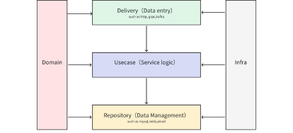

# [English](https://github.com/linchengzhi/go-clean-backend) | [中文](https://github.com/linchengzhi/go-clean-backend/blob/main/README_ZH.MD)

# Golang后端简洁架构--博客Demo

## 介绍
这个项目是使用Gin开发的一个博客Demo，使用了简洁框架的设计，用于展示简洁架构要如何设计。

## 简洁架构
简洁架构是一种软件设计原则，它的目标在于创造易于理解、可维护和可测试的软件系统。它的关注点在于职责分离，同时也能够兼容系统的可扩展性。

### 约束
1. **独立于框架**：不依赖任何框架，更改框架不会影响逻辑的设计，无论是使用Gin还是Go-zero作为框架，都能简单得进行替换。
2. **不依赖组件**：此项目使用了GORM来操作MySQL，但系统可以使用其他任何数据库来替换MySQL，例如Mongo，SQLite。替换组件不会对其他层有影响。
3. **容易测试**：各层业务逻辑可以在不需要UI，不需要数据库，不需要一切外界组件的情况下被测试，各层测试时不依赖下一层。

### 层级
通常的简洁架构是这四层：
- Entities
- Usecase
- Controller
- Framework & Driver

此项目中，也是四层，但稍有不同：
- Domain
- Repository
- Usecase
- Delivery
[]()
### Domain
Domain和Entities相同，这层会在所有层中使用。在这层中，包含系统的核心业务实体，业务转换结构，错误定义，通用定义和常量等。除了结构定义之外，还有接口定义也放在这一层，如repository层，usecase层的接口。

### Repository
Repository层负责数据的交互，包括数据库操作，缓存操作，发送通知，请求第三方服务接口等。例如MySQL的交互，gRPC请求其他微服务，HTTP发送通知消息等。Repository的接口在Domain层定义，这样是为了把MySQL换成Mongo时，就只需要实现Mongo的接口，保持接口的一致性，上层不需要修改。

### Usecase
此层是用例层，封装和实现系统的所有用例。所有流入流出的数据，都在这里处理后，流向Repository层，或者返回Delivery层。一个用例通常会有一个行为者或用户、一个动作和一个响应。Usecase层的接口，一般放在Domain层，若项目较小，改动不大，也可以放在本层，此项目较小。

### Delivery
该层级又名接口适配器，主要用于数据传递，外部数据的传入，用例的触发都放在这层，例如HTTP，gRPC，Kafka等数据，以及定时任务等。以API调用为例，将用户传递的参数进行整理成用例（Usecase）所需的数据格式，接收用例（Usecase）处理后返回的数据转换成响应的数据。

## 目录说明
```shell
Api        # 对应Delivery层，按协议类型分类，本Demo只使用了HTTP。
Build      # 构建项目的文件，一般放Docker，Makefile等文件
Cmd        # 项目运行入口，放Main函数和初始化代码
Config     # 配置文件目录
Docs       # 文档目录，存在项目说明文档
Domain     # 存在实体结构，转换结构，以及常量，错误等定义
Infra      # 基础组件目录，各类组件的初始化，如MySQL，Redis，Log
Repository # 负责数据的交互，包括数据库操作，缓存操作，发送通知，请求第三方服务接口等
Usecase    # 用例层，若逻辑复杂，可分多个目录
```
# 运行
1、修改配置的MySQL配置

2、执行运行命令
```shell
go run cmd/main.go
```
# 许可证
本项目采用MIT许可证，详情请参阅[LICENSE](./LICENSE)文件。